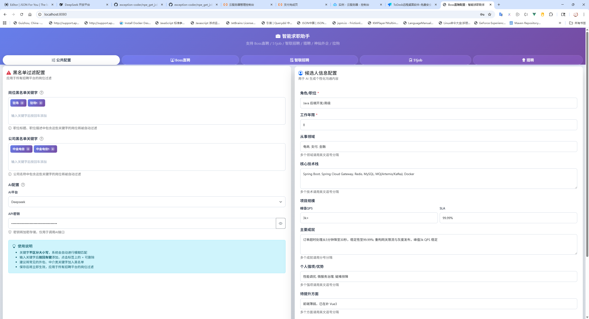
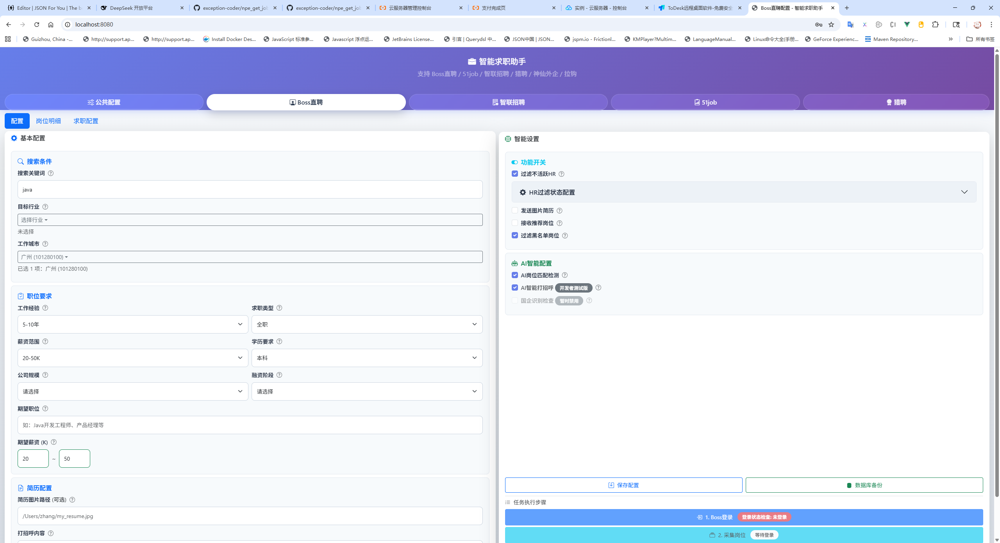
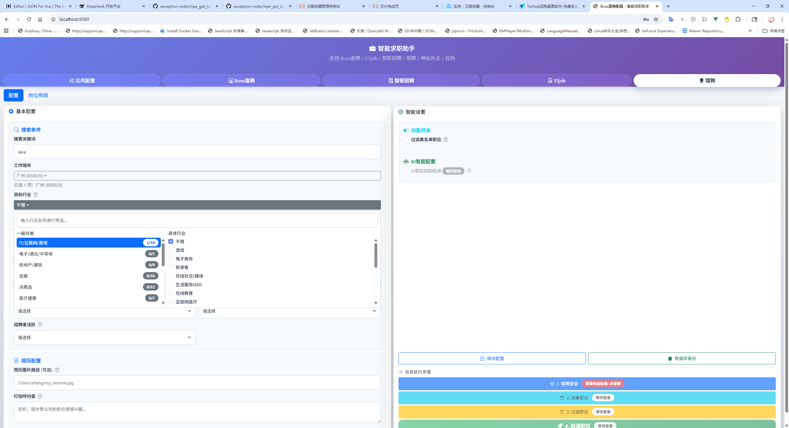

## 运行界面
### 公共配置

### Boss直聘

### 猎聘


## 运行准备
### jdk21

## 运行
`getjobs.GetJobsApplication` 直接运行main函数

```java
public static void main(String[] args) {
        SpringApplication.run(GetJobsApplication.class, args);
    }
```
### 访问
浏览器访问 http://localhost:8080