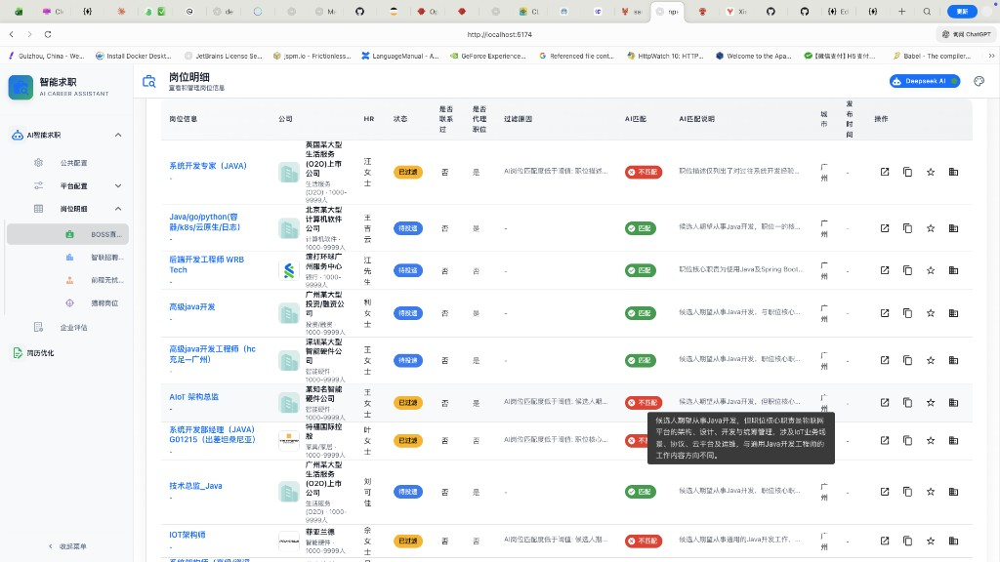
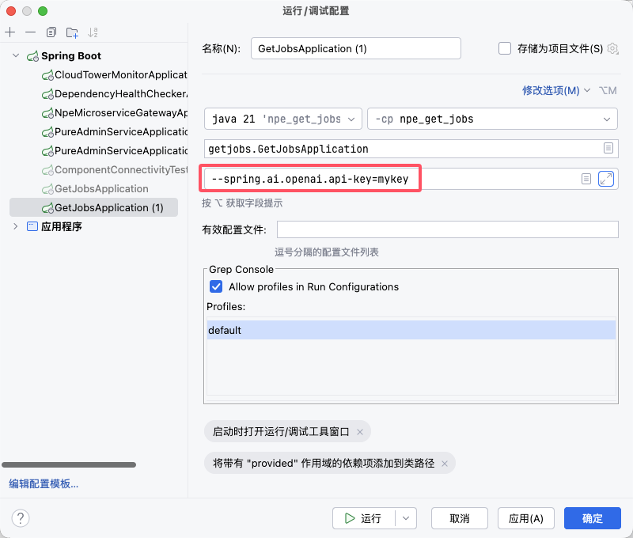
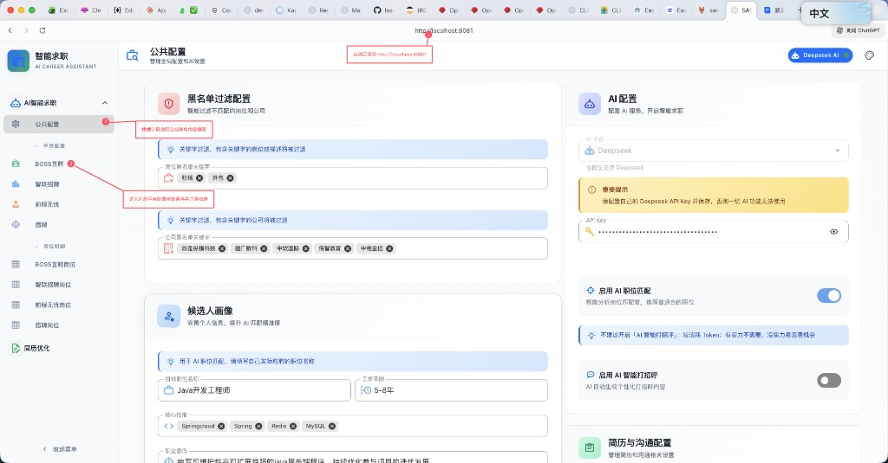
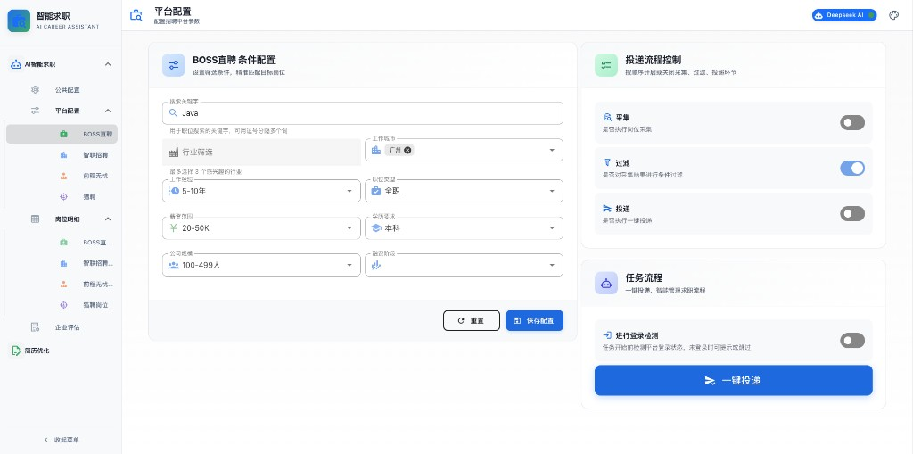

# GetJobs - 你的AI求职小助理 🤖✨

还在为找工作焦头烂额吗？😩 每天刷几百个岗位，改简历改到深夜，结果投出去的简历都石沉大海？🌊

别慌！你的求职救星来了！🚀 **GetJobs**，一个专为“懒人”打造的自动化全平台简历投递智能工具，让你告别繁琐的重复劳动，轻松躺赢！😎

---

## 🎬 快速预览

看看 GetJobs 是如何工作的：


---

### 🌟 我们能做什么？

-   **🔍 全平台岗位一网打尽**
    -   还在Boss直聘、猎聘、51Job之间来回切换？out啦！我们帮你聚合全平台岗位，一处看遍所有机会！

-   **🧠 AI智能分析，比你更懂你**
    -   根据你的求职期望，智能分析和筛选海量岗位，只推荐最适合你的那一个！🎯

-   **✍️ 定制化“打招呼”话术**
    -   还在用“您好，我对这个职位很感兴趣”？太普通了！AI会根据你的简历和职位要求，生成最亮眼的“破冰”话术，让HR一眼就看到你！🤩

-   **📤 全自动简历投递**
    -   一键开启，AI帮你自动完成简历投递，7x24小时不间断，让你把时间花在更重要的事情上，比如...准备面试！😉

-   **🚫 黑名单过滤，精准避坑**
    -   遇到过不靠谱的公司或岗位？一键拉黑，永不相见！帮你过滤掉所有不想去的公司和岗位。

-   **🏢 国企/事业单位增强**
    -   想进体制内？我们特别增强了对国企和事业单位的识别能力，即使平台没提供筛选，也能帮你精准找到！

-   **🗺️ 智能城市过滤**
    -   只想在目标城市发展？平台推送的异地岗位太多？别担心！智能城市过滤帮你精准锁定目标城市，过滤掉所有非目标城市的岗位，不再浪费时间！

---

### 📋 岗位明细一览

在「岗位明细」页面，你可以集中查看和管理全平台采集的岗位：岗位信息、公司、HR、状态（待投递/已过滤）、是否联系过、是否代理、过滤原因、**AI 匹配结果与说明**、城市、发布时间及快捷操作。下图是岗位明细的完整界面与 AI 匹配能力展示。



---

## 📖 使用说明

### ⚠️ 重要：启动时设置 AI API Key

使用一切 AI 功能前，**必须在启动应用时**设置 `spring.ai.openai.api-key`。  

在 IDE（如 IntelliJ IDEA）的运行配置中，于「程序实参」里填写：

```text
--spring.ai.openai.api-key=你的密钥
```

该参数**仅用于满足启动校验**，可填写任意字符（如 `dummy` 或 `mykey`）即可。**启动后请进入「公共配置」页，在 AI 配置中填写真实的 Deepseek API Key**——本项目的 AI 功能实际使用的是 Deepseek。



---

### 第一步：配置公共信息 🔧

在开始使用之前，你需要先完成公共配置，这些配置会应用到所有投递平台：

1. 进入系统后，找到**公共配置**（访问地址一般为 `http://localhost:8081`）
2. 配置以下关键信息：
   - **黑名单过滤配置**：关键字过滤（岗位/描述）、关键字过滤（公司），智能过滤不匹配的岗位和公司
   - **候选人画像**：目标职位名称、工作年限、核心技能、职业意向，提升 AI 匹配精准度
   - **AI 配置**：选择 AI 服务提供商（如 Deepseek）、填写 API Key、开启/关闭 AI 职位匹配与智能打招呼
   - **简历与沟通配置**：管理简历和沟通相关设置



💡 **小提示**：公共配置只需设置一次，后续可随时调整！

---

### 第二步：配置投递平台 🎯

完成公共配置后，就可以针对具体的投递平台进行个性化配置了：

1. **选择投递平台**
   - 在左侧导航栏选择你想使用的平台（如 BOSS直聘、猎聘、51Job 等）

2. **设置检索条件**
   - **搜索关键字**：输入职位关键词（如"Java开发"、"产品经理"），可用逗号分隔多个关键词
   - **工作城市**：选择你的目标城市（支持多选）
   - **工作经验**：选择符合你的经验范围
   - **职位类型**：全职/兼职/实习
   - **薪资范围**：设置你的期望薪资区间
   - **学历要求**：选择学历要求
   - **行业筛选**：最多选择 3 个感兴趣的行业
   - **公司规模**：选择偏好的公司规模
   - **融资阶段**：选择公司融资阶段偏好

3. **保存配置**
   - 配置完成后，点击**保存配置**按钮

4. **开始投递** 🚀
   - 点击**一键投递**按钮，系统将自动开始为你筛选和投递简历
   - 你可以随时点击**手动加载任务状态**查看投递进度



---

### 第三步：坐等面试通知 ☕

配置完成后，GetJobs 会 7x24 小时不间断地为你工作：
- ✅ 自动搜索符合条件的岗位
- ✅ AI 智能分析岗位匹配度
- ✅ 生成个性化打招呼话术
- ✅ 自动投递简历

你只需要：
- 定期查看投递进度和反馈
- 准备面试，等待 HR 的好消息！📧

---

### ⏱️ 为什么投递比较慢？

GetJobs 的投递流程是：**先采集岗位 → 再过滤（黑名单、AI 匹配等）→ 再逐个投递**。每个岗位都会完整走完一轮操作，且**全程模拟真人操作**，每个岗位之间会**故意延迟 3～5 秒**，因此整体会显得比较慢。

这样设计的目的：

- **为真实求职者服务**：面向个人求职者提高效率，不做批量、刷量式投递。
- **保护平台与大家**：乱投、无效投递既伤害招聘平台，也会拉低整体环境，适度、精准更可持续。
- **每天几十个有效投递就够**：质量优于数量，建议把工具当作「挂机小助手」，而不是追求极速海投。

**使用建议**：工作日下午或晚饭后开启一键投递，让程序在后台慢慢跑即可；不必追求短时间内投递大量岗位。

---

### ⚠️ 注意事项

- 建议先在单个平台测试配置是否正确，确认无误后再开启多平台投递
- 定期检查黑名单，避免错过好机会
- 合理设置投递频率，避免被平台限制
- 及时更新简历信息，保持信息的准确性
- **推荐工作日下午或晚饭后挂机投递**，每天几十个有效投递即可，重在质量而非数量

---

## 💬 获取一对一指导

如果你在使用过程中遇到问题，或希望获得**一对一配置指导、简历优化建议、求职策略咨询**，欢迎通过微信联系我。因时间精力有限，**小白想直接上手、需要手把手协助的，可添加后咨询有偿协助**（如代配置、远程协助等）。

**扫码添加好友**（昵称：凯，所在地：广东广州）：

> 如果你在 GitHub 或其他平台上看到本 README，但二维码图片无法正常加载，可能是由于国内网络环境或图片加速服务异常导致。你可以尝试「在新标签页中打开图片」、科学上网后刷新页面，或将仓库代码克隆到本地后，直接在 `docs/images/readme/wechat-contact.png` 路径下找到并打开该图片。


扫一扫上面的二维码图案，加我为朋友。添加时请备注「GetJobs」或「求职助手」，方便快速通过。

---

还在等什么？快来试试 **GetJobs**，让AI成为你最得力的求职伙伴，开启高效求职新姿势！💪
