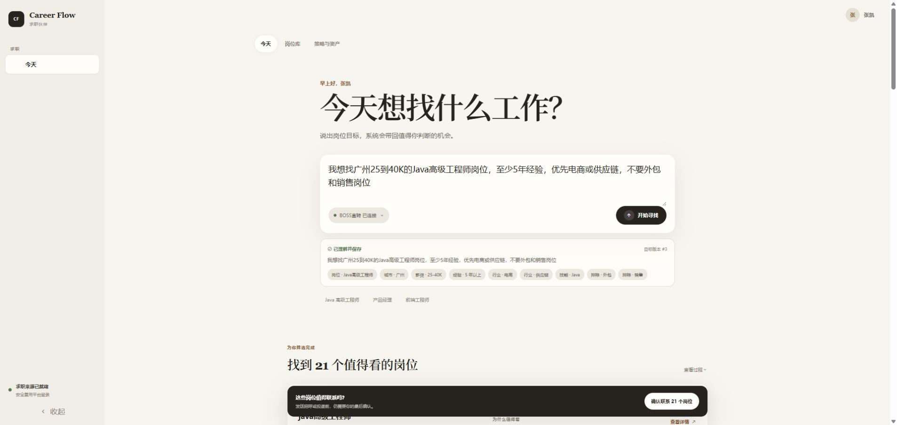
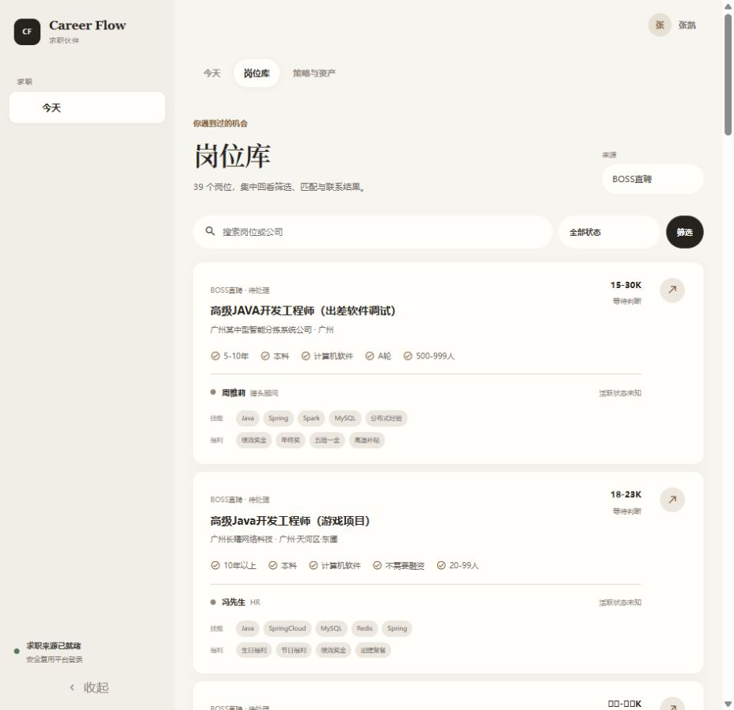
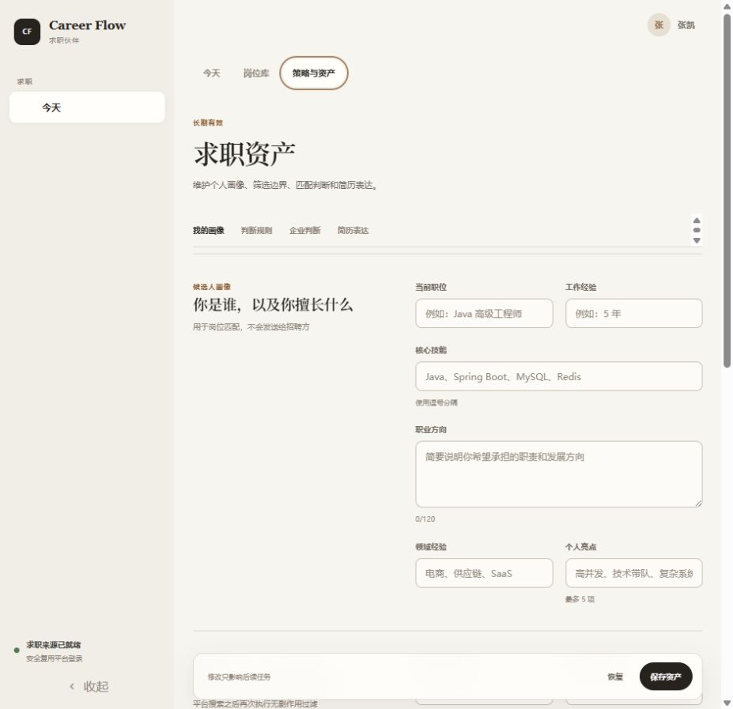
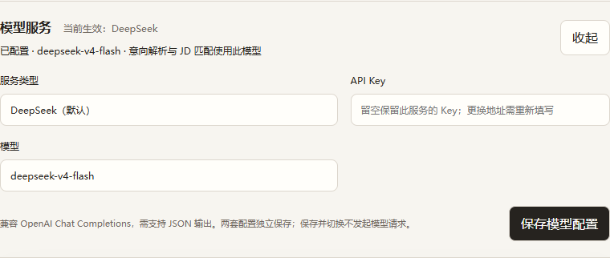
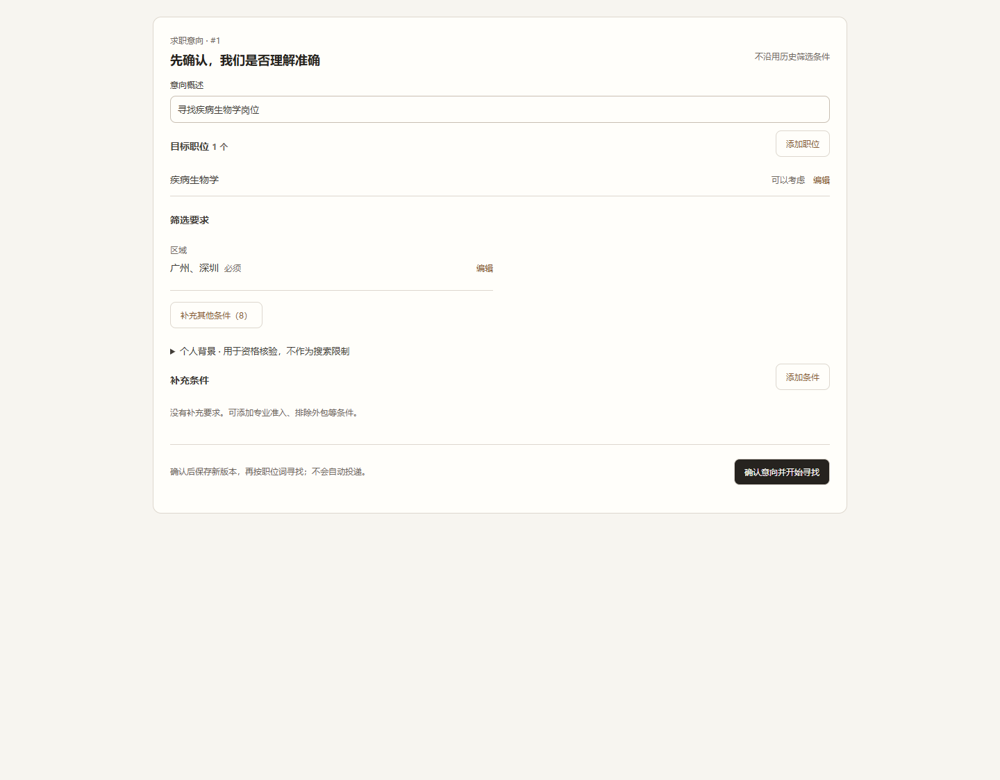
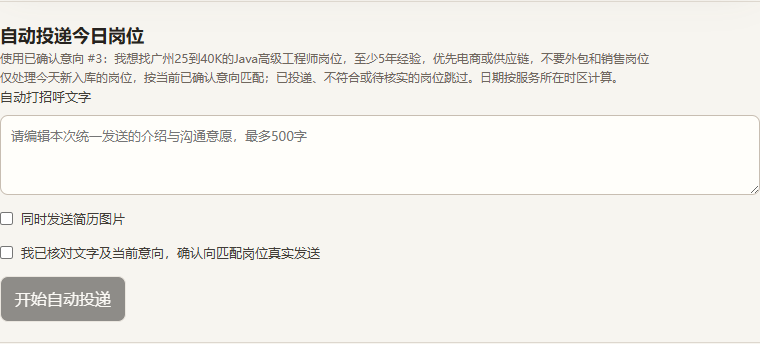
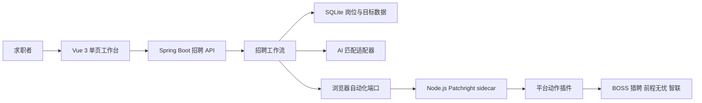

# Career Flow

**认清自己的方向，找到真正喜欢的工作。**

Career Flow 是一个运行在你自己电脑上的求职伙伴。你不用研究招聘网站的复杂筛选项，只需要用一句话说清楚岗位、城市、薪资和不想要的机会。它会帮你登录招聘平台、找到岗位、整理信息、排除不合适的机会，再把真正值得判断的岗位带回来。



它不是失控的“海投机器人”。搜索、采集和匹配默认不会联系招聘方；是否打开沟通窗口、是否发送消息，最终都由你确认。

> BOSS 搜索采集链路已有真实页面验证；新增的自动文字投递已通过模拟测试，尚未完成真实招聘者端到端验证。猎聘、前程无忧和智联招聘仍在迁移中。

## 快速导航

- [它能帮你做什么](#它能帮你做什么)
- [真实产品画面](#真实产品画面)
- [当前进度](#当前进度)
- [它怎么陪你找工作](#它怎么陪你找工作)
- [使用指南](#使用指南)
- [架构概览](#架构概览)
- [环境要求](#环境要求)
- [快速启动](#快速启动)
- [本地开发](#本地开发)
- [配置说明](#配置说明)
- [安全与副作用边界](#安全与副作用边界)
- [项目结构](#项目结构)
- [主要接口](#主要接口)
- [验证与测试](#验证与测试)
- [已知边界](#已知边界)

---

## 它能帮你做什么

| 找工作时最消耗精力的事 | Career Flow 的处理方式 |
|---|---|
| 每个平台重复填写岗位、城市和薪资 | 自然语言生成平台无关的意向卡，采集后与 JD 逐项匹配 |
| 岗位太多，来回翻页后记不住 | 自动登记成岗位库，去重并保留公司、地点、经验等事实 |
| 外包、销售、驻场等岗位反复出现 | 根据本次确认的意向条件判断，不暗中沿用旧筛选条件 |
| 看完职位描述仍不知道是否值得投 | 结合候选人画像和岗位信息给出匹配判断 |
| 担心自动化误发消息 | 搜索不发送；自动投递需编辑文字并明确确认，支持停止后续投递 |
| 换平台后又要重新配置 | 画像、规则和目标条件跨平台复用，平台只负责执行 |

你只需要做三件事：描述目标、完成平台扫码、确认真正想沟通的岗位。

---

## 真实产品画面

### 1. 先说人话，不填复杂表单

README 首屏就是一次真实运行：输入“广州 25–40K、至少 5 年经验、优先电商或供应链、不要外包和销售”这样的自然语言，系统会保存原文，并拆成职位、城市、薪资、经验、行业、技能和排除项。平台未登录时，当前页面直接给出扫码入口，不会让任务偷偷继续。

### 2. 找到的岗位不会刷完就丢

搜索和滚动加载到的岗位会进入统一岗位库。你可以按平台、状态、岗位或公司筛选，集中回看哪些岗位待判断、已过滤、待联系或已经处理。



### 3. 它会越来越懂你的边界

候选人画像、筛选边界、企业判断和简历表达都属于你自己的长期求职资产。它们不会固化在某个平台，也不会未经确认发送给招聘方。



---

## 当前进度

---

平台适配器已进入统一注册表，但“已注册”不等于“已完成真实页面回归”。

| 平台 | 插件注册 | 登录会话 | 岗位发现 | 滚动增量 | 沟通准备 | 真实回归状态 |
|---|:---:|:---:|:---:|:---:|:---:|---|
| BOSS 直聘 | 已完成 | 已完成 | 已完成 | 已完成 | 已完成 | 已验证搜索、登记、筛选、匹配和无副作用沟通准备 |
| 猎聘 | 已完成 | 已接线 | 已接线 | 已接线 | 已接线 | 待按真实页面逐动作迁移和回归 |
| 前程无忧 | 已完成 | 已接线 | 已接线 | 已接线 | 已接线 | 待按真实页面逐动作迁移和回归 |
| 智联招聘 | 已完成 | 已接线 | 已接线 | 已接线 | 已接线 | 待按真实页面逐动作迁移和回归 |

BOSS 直聘当前以岗位搜索或推荐接口响应作为岗位数据主源。DOM 只负责触发页面行为，并在接口数据不可用时提供降级判断。已验证一次搜索批次和一次滚动批次可以完成岗位去重、登记、筛选与匹配，工作流在联系前停止等待用户确认。

---

## 它怎么陪你找工作

1. **说出目标**：像和朋友聊天一样描述岗位、地点、薪资、经验和排除项。
2. **扫码登录**：选择招聘平台；未登录时打开真实平台页面，由你亲自扫码。
3. **寻找机会**：系统搜索岗位并滚动加载，把平台信息整理成统一格式。
4. **替你初筛**：先执行确定性过滤，再结合你的画像做匹配判断。
5. **把决定交给你**：候选岗位集中展示，只有你确认后才准备沟通。
6. **安全地继续**：可逐岗检查沟通入口，也可编辑统一打招呼文字并授权今日岗位自动投递。

未登录、登录状态无法确认、浏览器服务不可用或用户尚未确认时，工作流必须停止，不得将失败伪装成成功。

---

## 使用指南

### 1. 配置模型服务

打开首页「模型服务 → 配置模型」。默认选择 DeepSeek，填写 API Key 并选择模型后点击「保存模型配置」。意向解析和 JD 匹配使用该模型。



- DeepSeek 默认模型为 `deepseek-v4-flash`；模型是否可用以你的服务账号为准。
- 使用其他平台时，切换「自定义兼容服务」，填写 Base URL、API Key、模型 ID。Base URL 填基础地址（例如 `https://example.com/v1`），不要包含 `/chat/completions`。
- 自定义服务必须兼容 OpenAI Chat Completions 并支持 JSON 输出，仅更换 URL 不能适配所有原生 API 协议。
- 两套配置独立保存，保存后生效。已有 Key 可留空保留；更换自定义地址必须重新填写 Key。保存成功不代表远程模型调用已验证。
- 解析会将求职描述发送给所选模型服务，匹配还会发送岗位信息；只配置你信任的服务。不要提交密钥、个人简历或本机数据库。

### 2. 解析并确认求职意向

在「今天想找什么工作？」填写自己的需求，例如：

> 我想找广州25到40K的Java高级工程师岗位，至少5年经验，优先电商或供应链，不要外包和销售岗位。

点击「解析求职意向」后，先检查模型是否理解正确：目标岗位及搜索词、区域、薪资、经验、学历、行业、规模和融资阶段等。未说明的条件不会自动补成硬要求。



- 岗位较多时显示紧凑列表，点击「编辑」修改名称、搜索词和考虑程度。
- 筛选条件默认显示摘要；点击编辑可设置必须、优先或排除。「补充其他条件」中可填写未说明项，原文依据可展开核对。
- 核对后点击「确认意向并开始寻找」，保存新的意向版本并进入搜索；平台未登录时先扫码。不要把整段描述直接作为搜索词。
- 解析失败时原文保留，不会自动搜索。输出截断、接口失败和 JSON 校验失败会分别提示。

### 3. 自动投递今天采集入库的岗位

先完成意向确认和岗位采集，再使用首页「自动投递今日岗位」。当前仅支持 BOSS 直聘。



1. 核对页面显示的**已确认意向编号和概述**，避免使用旧意向；意向变化后需重新确认。
2. 编辑本次统一发送的打招呼文字（1–500字）。系统不会替你预填或虚构经历。
3. 如需同时发送简历图片，勾选选项并填写**运行服务电脑上的绝对路径**。支持 PNG/JPG/JPEG，文件不得超过5MB；未勾选则不发图片。
4. 勾选「我已核对文字及当前意向，确认向匹配岗位真实发送」，点击「开始自动投递」。**这是实际发送授权，不是预览。**
5. 查看已检查数量、已发送数量和当前处理状态；需要中止时点击「停止后续投递」。

批次规则与边界：

- 「今日」按服务所在时区和岗位首次入库时间计算，不是平台发布时间，也不是历史岗位今天更新的时间。候选清单在启动时固定，运行中新增岗位不加入本批次。
- 使用本次固定的已确认意向重新匹配 JD；只处理明确建议投递的岗位，跳过历史已投递、不符合及待核实岗位。
- 顺序处理，成功后间隔约10秒再继续；今日候选超过500个时拒绝启动，需缩小采集范围。
- 先建立沟通，再进入消息页核对公司、岗位和联系人，发送用户编辑的文字；图片单独记录结果。
- 文字发送需确认新消息的送达或已读回执。失败或结果不明确时终止批次，不自动重发，请先核对平台聊天记录。
- 停止仅阻止后续岗位，不能撤回正在发送或已经发送的消息。任务状态保存在服务内存中，服务重启后不自动续投，成功联系记录保留在数据库。
- 执行时不要同时手动操作平台浏览器；遇到验证码、风控或登录过期，由用户处理，不能保证无人值守。

> 自动文字发送与批次编排目前通过模拟测试，真实平台端到端发送仍待验证。首次使用建议只采集少量目标岗位，观察结果；不要将点击成功当作投递成功。

---

## 架构概览


```mermaid
flowchart LR
    USER["求职者"] --> UI["Vue 3 单页工作台"]
    UI --> API["Spring Boot 招聘 API"]
    API --> WORKFLOW["招聘工作流"]
    WORKFLOW --> DATABASE["SQLite 岗位与目标数据"]
    WORKFLOW --> AI["AI 匹配适配器"]
    WORKFLOW --> PORT["浏览器自动化端口"]
    PORT --> SIDECAR["Node.js Patchright sidecar"]
    SIDECAR --> PLUGINS["平台动作插件"]
    PLUGINS --> SITES["BOSS 猎聘 前程无忧 智联"]
```

核心原则：

- Java 侧定义稳定的平台 SPI、工作流、持久化和 HTTP 契约。
- Node sidecar 负责浏览器生命周期与 Patchright 动作，不让平台选择器泄漏到业务层。
- 每个平台独立维护登录判断、搜索、采集、滚动和联系动作。
- 前端通过 Feature Manifest 组合路由，在同一工作台内切换平台、岗位库和求职资产。
- 平台差异只能在适配器中处理；通用岗位条件和岗位事实不能保存平台枚举码。

---

## 环境要求

| 依赖 | 要求 | 用途 |
|---|---|---|
| JDK | 21 | 编译并运行 Spring Boot |
| Maven | 本机可执行 `mvn` | 测试、前端生产构建和 JAR 打包 |
| Node.js | 20 或更高 | Patchright sidecar和前端本地开发 |
| Google Chrome | 本机已安装 | Patchright 使用 `channel: chrome` 启动持久会话 |
| npm | 随 Node.js 安装 | 安装 sidecar 和前端依赖 |

默认端口：

| 服务 | 地址 |
|---|---|
| 打包后的应用 | `http://127.0.0.1:8081` |
| Vite 开发服务器 | `http://127.0.0.1:5174` |
| Patchright sidecar | `http://127.0.0.1:17321` |

---

## 快速启动

以下命令均在仓库根目录执行。

### 1. 创建本机配置

Windows PowerShell：

```powershell
Copy-Item .env.example .env
```

macOS 或 Linux：

```bash
cp .env.example .env
```

只填写实际使用的 AI 服务。`.env` 已被 Git 忽略，不要提交真实密钥。

### 2. 安装 Patchright sidecar 依赖

```bash
npm ci --prefix node-services/recruitment-browser
```

### 3. 构建可执行应用

```bash
mvn clean package
```

Maven 会安装前端依赖、构建 Vue 应用，并将 `frontend/dist` 打入 Spring Boot JAR。

### 4. 启动应用

Windows：

```powershell
.\scripts\start.bat
```

macOS 或 Linux：

```bash
chmod +x scripts/start.sh
./scripts/start.sh
```

应用启动时会自动拉起 Patchright sidecar。浏览器访问 `http://127.0.0.1:8081` 即可进入求职工作台，不需要额外的系统账号登录。

首次使用某个平台时，在工作台点击“打开登录”，在平台页面中完成扫码。平台登录状态是搜索、匹配和联系流程的前置条件。

---

## 本地开发

安装依赖：

```bash
npm ci --prefix node-services/recruitment-browser
npm ci --prefix frontend
```

启动 Spring Boot；它会自动启动 sidecar：

```bash
mvn spring-boot:run
```

另开终端启动前端：

```bash
npm run dev --prefix frontend -- --host 127.0.0.1 --port 5174
```

开发时访问 `http://127.0.0.1:5174/workspace`。Vite 会将 `/api` 和 `/dicts` 请求代理到 `http://127.0.0.1:8081`。

如果需要独立调试 sidecar，应先将 `recruitment.browser.auto-start` 设为 `false`，再执行：

```bash
npm start --prefix node-services/recruitment-browser
```

---

## 配置说明

仓库只保存无密钥模板 `.env.example`。本机 `.env` 会由 `application.yml` 作为可选配置导入；部署环境也可以直接注入同名系统环境变量。

| 配置 | 必填 | 默认值 | 说明 |
|---|:---:|---|---|
| `OPENAI_API_KEY` | 否 | 空 | OpenAI 密钥 |
| `OPENAI_BASE_URL` | 否 | `https://api.openai.com` | OpenAI 兼容地址 |
| `OPENAI_MODEL` | 否 | `gpt-4o` | OpenAI 模型 |
| `DEEPSEEK_API_KEY` | 否 | 空 | DeepSeek 密钥 |
| `DEEPSEEK_BASE_URL` | 否 | `https://api.deepseek.com` | DeepSeek 地址 |
| `DEEPSEEK_MODEL` | 否 | `deepseek-v4-flash` | DeepSeek 初始默认模型，可在首页修改 |
| `QWEN_API_KEY` | 否 | 空 | 通义千问密钥 |
| `QWEN_BASE_URL` | 否 | DashScope 兼容地址 | 通义千问地址 |
| `QWEN_MODEL` | 否 | `qwen-plus` | 通义千问模型 |
| `HTTP_PROXY_HOST` | 否 | 空 | AI 请求使用的本地 HTTP 代理主机 |
| `HTTP_PROXY_PORT` | 否 | `0` | AI 请求使用的本地 HTTP 代理端口 |
| `RECRUITMENT_BROWSER_BASE_URL` | 否 | `http://127.0.0.1:17321` | Spring Boot 连接 sidecar 的地址 |
| `NPE_PATCHRIGHT_PORT` | 否 | `17321` | sidecar 监听端口 |
| `NPE_BROWSER_PROFILE_ROOT` | 否 | sidecar 下的 `.profiles` | 平台持久浏览器会话目录 |

首页流程需先配置模型服务才能解析意向。建议使用首页配置入口；单独填写其他历史 AI 提供商环境变量不会自动切换首页所选服务。没有有效模型配置时，不会将解析失败降级为原文搜索。

---

## 安全与副作用边界

- `.env`、浏览器登录资料和本地数据库均不得提交到 Git。
- 浏览器资料默认保存在 `node-services/recruitment-browser/.profiles/`，其中可能包含有效登录态。
- SQLite 数据库默认位于 `${user.home}/getjobs/npe_get_jobs.db`。
- 搜索、采集、滚动、岗位检查和沟通准备必须返回 `sideEffect: false`。
- 发送联系动作要求调用方明确传入 `confirmContact: true`；否则返回 `CONTACT_CONFIRMATION_REQUIRED`，联系数量为零。
- 自动投递另外要求 `confirmSend: true`、当前意向版本和非空打招呼文字；一旦授权即会真实联系匹配岗位，不再逐岗弹出确认。
- 工作流启动前和平台导航后都要重新检查登录状态，无法确认时按未登录处理。
- 平台出现验证码、风控、页面异常或超时时应停止并交还用户处理，不进行高频重试。

调试真实平台时，优先使用搜索、采集、筛选和沟通准备动作。不要在回归测试中调用确认发送接口。

---

## 项目结构

```text
npe_get_jobs/
├── frontend/                                  Vue 3 单页求职工作台
│   └── src/features/                          工作台、岗位库、平台配置和求职资产
├── node-services/recruitment-browser/         Patchright sidecar
│   └── src/platforms/                         BOSS、猎聘、前程无忧、智联平台动作
├── src/main/java/getjobs/modules/recruitment/ 招聘领域、工作流、SPI、适配器和接口
├── src/main/resources/                        Spring Boot 与 AI 配置
├── scripts/                                   Windows 和 Unix 启动脚本
├── .env.example                               无密钥本地配置模板
└── pom.xml                                    Java、前端构建与打包入口
```

职责边界：

- `domain`：平台能力、岗位、目标和工作流状态等稳定业务概念。
- `application` 与 `workflow`：岗位登记、筛选、匹配和联系确认的用例编排。
- `spi`：平台插件对业务层暴露的稳定端口。
- `platform`：Java 侧平台注册和 Patchright 适配。
- `browser`：sidecar 生命周期和 HTTP 客户端。
- `web`：对前端暴露招聘 HTTP API。
- `node-services/.../platforms`：真实站点 URL、接口响应解析、选择器和页面动作。

---

## 主要接口

| 方法 | 路径 | 作用 |
|---|---|---|
| `GET` | `/api/recruitment/browser/health` | 查询 Patchright sidecar 健康状态 |
| `GET` | `/api/recruitment/platforms` | 查询已注册平台及能力 |
| `POST` | `/api/recruitment/platforms/{platform}/sessions/open` | 打开或复用平台持久会话 |
| `GET` | `/api/recruitment/platforms/{platform}/sessions/{sessionId}/status` | 查询平台实际登录状态 |
| `POST` | `/api/recruitment/goals/interpret` | 解释并保存自然语言岗位目标 |
| `GET` | `/api/recruitment/goals/active` | 查询当前激活的岗位目标 |
| `POST` | `/api/recruitment/goals/confirm` | 确认意向并保存新版本 |
| `GET/PUT` | `/api/recruitment/model-settings` | 读取模型配置状态或保存配置，读取不返回 Key |
| `GET/POST` | `/api/recruitment/auto-delivery` | 查询批次进度或明确授权今日自动投递 |
| `POST` | `/api/recruitment/auto-delivery/stop` | 停止后续岗位，不撤回已发送消息 |
| `POST` | `/api/recruitment/workflows` | 在登录校验通过后启动岗位工作流 |
| `GET` | `/api/recruitment/workflows/{taskId}` | 查询运行状态、阶段和候选岗位 |
| `POST` | `/api/recruitment/workflows/{taskId}/contact/prepare` | 无副作用地检查沟通入口和编辑器 |
| `POST` | `/api/recruitment/workflows/{taskId}/contact` | 在显式确认后执行联系动作 |

sidecar 只监听本机回环地址，提供 `/health`、`/v1/sessions` 和 `/v1/actions`。业务前端不应绕过 Spring Boot 直接调用 sidecar。

---

## 验证与测试

```bash
# 后端测试
mvn test

# Patchright 平台动作契约测试
npm test --prefix node-services/recruitment-browser

# 前端生产构建
npm run build --prefix frontend

# 完整打包
mvn clean package
```

运行后可检查浏览器服务：

```bash
curl http://127.0.0.1:8081/api/recruitment/browser/health
```

真实平台回归应遵守以下顺序：登录检查、岗位搜索、初始采集、单次滚动、增量登记、筛选匹配、沟通准备。除非用户明确要求并确认候选清单，否则不得执行发送动作。

---

## 已知边界

- 招聘网站会持续调整接口、DOM 和风控策略，平台插件需要以真实页面回归结果为准。
- BOSS 直聘已完成当前页面版本的主链验证，但登录过期、验证码和站点变化仍可能中断运行。
- 猎聘、前程无忧和智联招聘目前只完成统一契约接线，尚未声明真实端到端可用。
- 当前 sidecar 依赖本机 Google Chrome，并以有头持久会话承载扫码登录和风控恢复。
- 前端生产包仍包含部分体积较大的历史依赖；后续会随旧页面移除继续收敛。
- 项目不会承诺无人值守的高频自动投递，也不会尝试绕过招聘平台限制。

---

## 许可证

本项目使用 [MIT License](LICENSE)。使用者需要自行承担账号安全、平台规则、数据保护和操作后果。
