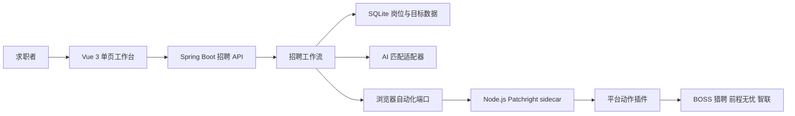

# Career Flow · 多平台求职工作台

`npe_get_jobs` 是面向个人求职者的本地工作台。项目将岗位目标、平台登录、岗位发现、结构化登记、规则筛选、AI 匹配和联系确认组织成一条可恢复的工作流，并通过插件接入 BOSS 直聘、猎聘、前程无忧和智联招聘。

项目正在进行插件化重构。当前先保证 BOSS 直聘链路真实可验证、默认无副作用，再按猎聘、前程无忧、智联招聘的顺序逐站迁移和回归。

> 本项目只用于个人、低频、审慎的求职辅助。请遵守招聘平台规则和适用法律，不要用于批量骚扰、刷量投递或绕过平台风控。

## 快速导航

- [项目定位](#项目定位)
- [当前进度](#当前进度)
- [核心工作流](#核心工作流)
- [架构概览](#架构概览)
- [环境要求](#环境要求)
- [快速启动](#快速启动)
- [本地开发](#本地开发)
- [配置说明](#配置说明)
- [安全与副作用边界](#安全与副作用边界)
- [项目结构](#项目结构)
- [主要接口](#主要接口)
- [验证与测试](#验证与测试)
- [已知边界](#已知边界)

---

## 项目定位

Career Flow 不再采用“平台 × 功能”的传统后台菜单，也不要求用户先填写大量平台枚举配置。主界面围绕一个问题展开：今天想找什么工作？

用户可以使用自然语言描述目标岗位。系统会保留原始表达，并将职位、城市、薪资、经验、行业、技能、排除项等语义解释为跨平台通用条件。一次运行引用已保存的目标版本，再由各平台插件将通用条件映射到平台能力。

当前产品边界包括：

- 多平台登录会话管理和登录前置校验。
- 岗位搜索、接口响应采集、滚动增量加载和结构化登记。
- 黑名单、通用规则和 AI 匹配。
- 候选岗位确认、沟通窗口准备和显式确认后的联系动作。
- 岗位记录、求职目标、候选人画像、企业判断规则和简历表达。

本项目不再提供无关的通用后台、系统账号登录页、Spring Boot Admin 管理界面或营销系统能力。

---

## 当前进度

平台适配器已进入统一注册表，但“已注册”不等于“已完成真实页面回归”。

| 平台 | 插件注册 | 登录会话 | 岗位发现 | 滚动增量 | 沟通准备 | 真实回归状态 |
|---|:---:|:---:|:---:|:---:|:---:|---|
| BOSS 直聘 | 已完成 | 已完成 | 已完成 | 已完成 | 已完成 | 已验证搜索、登记、筛选、匹配和无副作用沟通准备 |
| 猎聘 | 已完成 | 已接线 | 已接线 | 已接线 | 已接线 | 待按真实页面逐动作迁移和回归 |
| 前程无忧 | 已完成 | 已接线 | 已接线 | 已接线 | 已接线 | 待按真实页面逐动作迁移和回归 |
| 智联招聘 | 已完成 | 已接线 | 已接线 | 已接线 | 已接线 | 待按真实页面逐动作迁移和回归 |

BOSS 直聘当前以岗位搜索或推荐接口响应作为岗位数据主源。DOM 只负责触发页面行为，并在接口数据不可用时提供降级判断。已验证一次搜索批次和一次滚动批次可以完成岗位去重、登记、筛选与匹配，工作流在联系前停止等待用户确认。

---

## 核心工作流

1. 用户描述岗位目标，系统解释并保存通用岗位条件。
2. 用户选择招聘平台，系统打开或复用 Patchright 持久浏览器会话。
3. 系统检查平台登录状态；未登录时只允许打开登录页并等待用户扫码。
4. 登录成功后，平台插件搜索岗位并捕获平台接口响应。
5. 系统登记岗位事实，并执行黑名单、通用规则和 AI 匹配。
6. 系统展示候选岗位，等待用户确认。
7. 沟通准备动作只打开岗位或聊天上下文，不填写、不点击发送。
8. 只有独立确认请求明确允许联系时，发送动作才具备执行资格。

未登录、登录状态无法确认、浏览器服务不可用或用户尚未确认时，工作流必须停止，不得将失败伪装成成功。

---

## 架构概览


```mermaid
flowchart LR
    USER["求职者"] --> UI["Vue 3 单页工作台"]
    UI --> API["Spring Boot 招聘 API"]
    API --> WORKFLOW["招聘工作流"]
    WORKFLOW --> DATABASE["SQLite 岗位与目标数据"]
    WORKFLOW --> AI["AI 匹配适配器"]
    WORKFLOW --> PORT["浏览器自动化端口"]
    PORT --> SIDECAR["Node.js Patchright sidecar"]
    SIDECAR --> PLUGINS["平台动作插件"]
    PLUGINS --> SITES["BOSS 猎聘 前程无忧 智联"]
```

核心原则：

- Java 侧定义稳定的平台 SPI、工作流、持久化和 HTTP 契约。
- Node sidecar 负责浏览器生命周期与 Patchright 动作，不让平台选择器泄漏到业务层。
- 每个平台独立维护登录判断、搜索、采集、滚动和联系动作。
- 前端通过 Feature Manifest 组合路由，在同一工作台内切换平台、岗位库和求职资产。
- 平台差异只能在适配器中处理；通用岗位条件和岗位事实不能保存平台枚举码。

---

## 环境要求

| 依赖 | 要求 | 用途 |
|---|---|---|
| JDK | 21 | 编译并运行 Spring Boot |
| Maven | 本机可执行 `mvn` | 测试、前端生产构建和 JAR 打包 |
| Node.js | 20 或更高 | Patchright sidecar和前端本地开发 |
| Google Chrome | 本机已安装 | Patchright 使用 `channel: chrome` 启动持久会话 |
| npm | 随 Node.js 安装 | 安装 sidecar 和前端依赖 |

默认端口：

| 服务 | 地址 |
|---|---|
| 打包后的应用 | `http://127.0.0.1:8081` |
| Vite 开发服务器 | `http://127.0.0.1:5174` |
| Patchright sidecar | `http://127.0.0.1:17321` |

---

## 快速启动

以下命令均在仓库根目录执行。

### 1. 创建本机配置

Windows PowerShell：

```powershell
Copy-Item .env.example .env
```

macOS 或 Linux：

```bash
cp .env.example .env
```

只填写实际使用的 AI 服务。`.env` 已被 Git 忽略，不要提交真实密钥。

### 2. 安装 Patchright sidecar 依赖

```bash
npm ci --prefix node-services/recruitment-browser
```

### 3. 构建可执行应用

```bash
mvn clean package
```

Maven 会安装前端依赖、构建 Vue 应用，并将 `frontend/dist` 打入 Spring Boot JAR。

### 4. 启动应用

Windows：

```powershell
.\scripts\start.bat
```

macOS 或 Linux：

```bash
chmod +x scripts/start.sh
./scripts/start.sh
```

应用启动时会自动拉起 Patchright sidecar。浏览器访问 `http://127.0.0.1:8081` 即可进入求职工作台，不需要额外的系统账号登录。

首次使用某个平台时，在工作台点击“打开登录”，在平台页面中完成扫码。平台登录状态是搜索、匹配和联系流程的前置条件。

---

## 本地开发

安装依赖：

```bash
npm ci --prefix node-services/recruitment-browser
npm ci --prefix frontend
```

启动 Spring Boot；它会自动启动 sidecar：

```bash
mvn spring-boot:run
```

另开终端启动前端：

```bash
npm run dev --prefix frontend -- --host 127.0.0.1 --port 5174
```

开发时访问 `http://127.0.0.1:5174/workspace`。Vite 会将 `/api` 和 `/dicts` 请求代理到 `http://127.0.0.1:8081`。

如果需要独立调试 sidecar，应先将 `recruitment.browser.auto-start` 设为 `false`，再执行：

```bash
npm start --prefix node-services/recruitment-browser
```

---

## 配置说明

仓库只保存无密钥模板 `.env.example`。本机 `.env` 会由 `application.yml` 作为可选配置导入；部署环境也可以直接注入同名系统环境变量。

| 配置 | 必填 | 默认值 | 说明 |
|---|:---:|---|---|
| `OPENAI_API_KEY` | 否 | 空 | OpenAI 密钥 |
| `OPENAI_BASE_URL` | 否 | `https://api.openai.com` | OpenAI 兼容地址 |
| `OPENAI_MODEL` | 否 | `gpt-4o` | OpenAI 模型 |
| `DEEPSEEK_API_KEY` | 否 | 空 | DeepSeek 密钥 |
| `DEEPSEEK_BASE_URL` | 否 | `https://api.deepseek.com` | DeepSeek 地址 |
| `DEEPSEEK_MODEL` | 否 | `deepseek-chat` | DeepSeek 模型 |
| `QWEN_API_KEY` | 否 | 空 | 通义千问密钥 |
| `QWEN_BASE_URL` | 否 | DashScope 兼容地址 | 通义千问地址 |
| `QWEN_MODEL` | 否 | `qwen-plus` | 通义千问模型 |
| `HTTP_PROXY_HOST` | 否 | 空 | AI 请求使用的本地 HTTP 代理主机 |
| `HTTP_PROXY_PORT` | 否 | `0` | AI 请求使用的本地 HTTP 代理端口 |
| `RECRUITMENT_BROWSER_BASE_URL` | 否 | `http://127.0.0.1:17321` | Spring Boot 连接 sidecar 的地址 |
| `NPE_PATCHRIGHT_PORT` | 否 | `17321` | sidecar 监听端口 |
| `NPE_BROWSER_PROFILE_ROOT` | 否 | sidecar 下的 `.profiles` | 平台持久浏览器会话目录 |

至少配置一个 AI 提供商后，AI 匹配和目标解释才能使用对应模型。没有密钥时，浏览器会话、确定性岗位采集和规则过滤仍可独立运行，但依赖 AI 的步骤会受到限制。

---

## 安全与副作用边界

- `.env`、浏览器登录资料和本地数据库均不得提交到 Git。
- 浏览器资料默认保存在 `node-services/recruitment-browser/.profiles/`，其中可能包含有效登录态。
- SQLite 数据库默认位于 `${user.home}/getjobs/npe_get_jobs.db`。
- 搜索、采集、滚动、岗位检查和沟通准备必须返回 `sideEffect: false`。
- 发送联系动作要求调用方明确传入 `confirmContact: true`；否则返回 `CONTACT_CONFIRMATION_REQUIRED`，联系数量为零。
- 工作流启动前和平台导航后都要重新检查登录状态，无法确认时按未登录处理。
- 平台出现验证码、风控、页面异常或超时时应停止并交还用户处理，不进行高频重试。

调试真实平台时，优先使用搜索、采集、筛选和沟通准备动作。不要在回归测试中调用确认发送接口。

---

## 项目结构

```text
npe_get_jobs/
├── frontend/                                  Vue 3 单页求职工作台
│   └── src/features/                          工作台、岗位库、平台配置和求职资产
├── node-services/recruitment-browser/         Patchright sidecar
│   └── src/platforms/                         BOSS、猎聘、前程无忧、智联平台动作
├── src/main/java/getjobs/modules/recruitment/ 招聘领域、工作流、SPI、适配器和接口
├── src/main/resources/                        Spring Boot 与 AI 配置
├── scripts/                                   Windows 和 Unix 启动脚本
├── .env.example                               无密钥本地配置模板
└── pom.xml                                    Java、前端构建与打包入口
```

职责边界：

- `domain`：平台能力、岗位、目标和工作流状态等稳定业务概念。
- `application` 与 `workflow`：岗位登记、筛选、匹配和联系确认的用例编排。
- `spi`：平台插件对业务层暴露的稳定端口。
- `platform`：Java 侧平台注册和 Patchright 适配。
- `browser`：sidecar 生命周期和 HTTP 客户端。
- `web`：对前端暴露招聘 HTTP API。
- `node-services/.../platforms`：真实站点 URL、接口响应解析、选择器和页面动作。

---

## 主要接口

| 方法 | 路径 | 作用 |
|---|---|---|
| `GET` | `/api/recruitment/browser/health` | 查询 Patchright sidecar 健康状态 |
| `GET` | `/api/recruitment/platforms` | 查询已注册平台及能力 |
| `POST` | `/api/recruitment/platforms/{platform}/sessions/open` | 打开或复用平台持久会话 |
| `GET` | `/api/recruitment/platforms/{platform}/sessions/{sessionId}/status` | 查询平台实际登录状态 |
| `POST` | `/api/recruitment/goals/interpret` | 解释并保存自然语言岗位目标 |
| `GET` | `/api/recruitment/goals/active` | 查询当前激活的岗位目标 |
| `POST` | `/api/recruitment/workflows` | 在登录校验通过后启动岗位工作流 |
| `GET` | `/api/recruitment/workflows/{taskId}` | 查询运行状态、阶段和候选岗位 |
| `POST` | `/api/recruitment/workflows/{taskId}/contact/prepare` | 无副作用地检查沟通入口和编辑器 |
| `POST` | `/api/recruitment/workflows/{taskId}/contact` | 在显式确认后执行联系动作 |

sidecar 只监听本机回环地址，提供 `/health`、`/v1/sessions` 和 `/v1/actions`。业务前端不应绕过 Spring Boot 直接调用 sidecar。

---

## 验证与测试

```bash
# 后端测试
mvn test

# Patchright 平台动作契约测试
npm test --prefix node-services/recruitment-browser

# 前端生产构建
npm run build --prefix frontend

# 完整打包
mvn clean package
```

运行后可检查浏览器服务：

```bash
curl http://127.0.0.1:8081/api/recruitment/browser/health
```

真实平台回归应遵守以下顺序：登录检查、岗位搜索、初始采集、单次滚动、增量登记、筛选匹配、沟通准备。除非用户明确要求并确认候选清单，否则不得执行发送动作。

---

## 已知边界

- 招聘网站会持续调整接口、DOM 和风控策略，平台插件需要以真实页面回归结果为准。
- BOSS 直聘已完成当前页面版本的主链验证，但登录过期、验证码和站点变化仍可能中断运行。
- 猎聘、前程无忧和智联招聘目前只完成统一契约接线，尚未声明真实端到端可用。
- 当前 sidecar 依赖本机 Google Chrome，并以有头持久会话承载扫码登录和风控恢复。
- 前端生产包仍包含部分体积较大的历史依赖；后续会随旧页面移除继续收敛。
- 项目不会承诺无人值守的高频自动投递，也不会尝试绕过招聘平台限制。

---

## 许可证

本项目使用 [MIT License](LICENSE)。使用者需要自行承担账号安全、平台规则、数据保护和操作后果。
